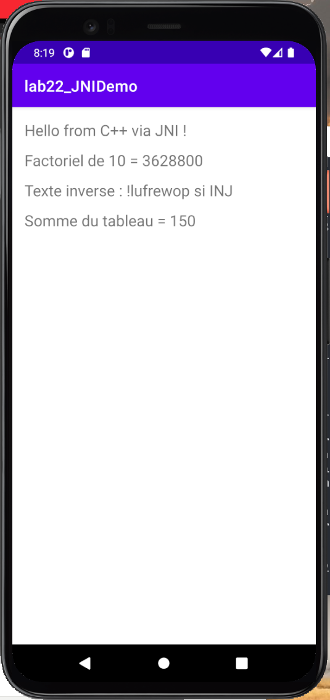
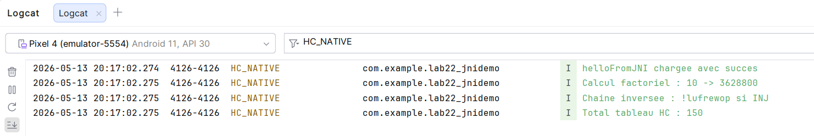

# Lab 22 — JNI Demo : Java Native Interface sur Android

## Présentation

Ce laboratoire illustre l'intégration de code natif C++ dans une application Android via JNI (Java Native Interface). L'application **lab22_JNIDemo** appelle plusieurs fonctions natives, envoie des paramètres Java vers C++, récupère des résultats calculés côté natif, et journalise les événements dans Logcat.

---

## Ce qui a été réalisé

### 1. Structure du projet
- Projet Android créé avec le template **Native C++**
- Bibliothèque native compilée avec **CMake**
- Chargement via `System.loadLibrary("native-lib")`

### 2. Fonctions natives implémentées en C++

| Fonction | Description | Résultat |
|---|---|---|
| `helloFromJNI()` | Retourne une chaîne depuis C++ | `Hello from C++ via JNI !` |
| `factorial(10)` | Calcule la factorielle en natif | `3628800` |
| `reverseString()` | Inverse une chaîne Java en C++ | `!lufrewop si INJ` |
| `sumArray()` | Calcule la somme d'un tableau | `150` |

### 3. Personnalisation
- `LOG_TAG` : `HC_NATIVE`
- Macros de log : `HC_LOGI` / `HC_LOGE`
- Variables renommées : `result`, `raw`, `hcStr`, `hcElements`, `total`

---

## Résultats

### Émulateur

### Logcat

---

## Technologies utilisées
- Android Studio
- Java
- C++ / NDK
- CMake
- JNI
- Logcat
